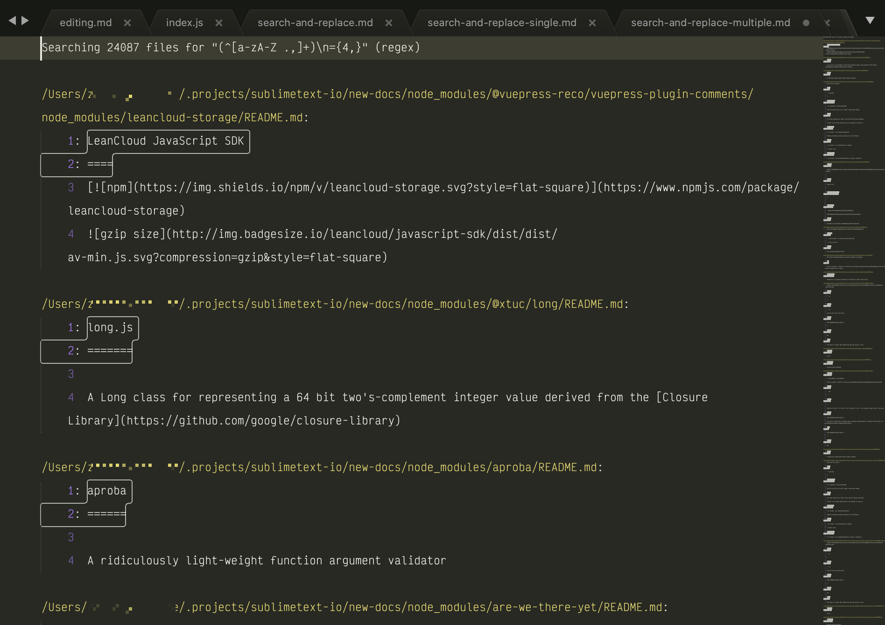

Sublime Text features
two main types of search:

- [Single File](#single-file)
- [Multiple Files](#multiple-files)

Both support [regular expressions](#regular-expressions),
a powerful tool for searching and replacing text.


## Single File

### Searching

Keyboard shortcuts related to the search panel:

| Description                | Shortcut                |
| -------------------------- | ----------------------- |
| **Open search panel**      | <Key k="ctrl+f" />      |
| Toggle regular expressions | <Key k="alt+r" />       |
| Toggle case sensitivity    | <Key k="alt+c" />       |
| Toggle exact match         | <Key k="alt+w" />       |
| Find next                  | <Key k="enter" />       |
| Find previous              | <Key k="shift+enter" /> |
| Find all                   | <Key k="alt+enter" />   |


### Incremental Search

Keyboard shortcuts related to the incremental search panel:

| Description                       | Shortcut                |
| --------------------------------- | ----------------------- |
| **Open incremental search panel** | <Key k="ctrl+i" />      |
| Toggle regular expressions        | <Key k="alt+r" />       |
| Toggle case sensitivity           | <Key k="alt+c" />       |
| Toggle exact match                | <Key k="alt+w" />       |
| Find next                         | <Key k="enter" />       |
| Find previous                     | <Key k="shift+enter" /> |
| Find all                          | <Key k="alt+enter" />   |


The only difference between this panel
and the regular search panel
lies in the behavior of the <Key k="enter" /> key.
In incremental searches,
it will select the next match in the file
and dismiss the search panel for you.
Choosing between this panel or the regular search panel
is a matter of preference.


### Replacing Text

Keyboard shortcuts related to the replace panel:


| Description            | Shortcut                   |
| ---------------------- | -------------------------- |
| **Open replace panel** | <Key k="ctrl+h" />         |
| Replace next           | <Key k="ctrl+shift+h" />   |
| Replace all            | <Key k="ctrl+alt+enter" /> |


### Tips

#### Other Ways of Searching in Files

[Goto Anything](../file-management/navigation.md#goto-anything)
provides the `#` operator
to search in the filtered file.


#### Other Search-Related Key Bindings

These key bindings work
when the search panel is hidden:

| Description                                  | Shortcut             |
| -------------------------------------------- | -------------------- |
| Search forward using most recent pattern     | <Key k="f3" />       |
| Search backwards using most recent pattern   | <Key k="shift+f3" /> |
| Select all matches using most recent pattern | <Key k="alt+f3" />   |

You can also perform searches
based on the current selection:

| Description                     | Shortcut                 |
| ------------------------------- | ------------------------ |
| Search using current selection  | <Key k="ctrl+e" />       |
| Replace using current selection | <Key k="ctrl+shift+e" /> |


### Multiline Search

You can type in multiline search patterns
into search panels.
To enter newline characters,
press <Key k="ctrl+enter" />.


Note that search panels are resizable too.


## Multiple Files

### Searching

Keyboard shortcuts related to Find in Files:

| Description                | Shortcut                 |
| -------------------------- | ------------------------ |
| **Open Find in Files**     | <Key k="ctrl+shift+f" /> |
| Toggle regular expressions | <Key k="alt+r" />        |
| Toggle case sensitivity    | <Key k="alt+c" />        |
| Toggle exact matches       | <Key k="alt+w" />        |
| Find next                  | <Key k="Enter" />        |


### Search Scope

The **Where** field in Find in Files
limits the search scope.
You can define scopes in several ways:

- Adding individual directories (Unix-style paths, even on Windows)
- Adding/excluding files based on wildcards
- Adding symbolic locations (`<open folders>`, `<open files>`...)

It is also possible to combine these filters using commas; for example:


Press the **...** button in the search panel
to display a menu containing scope options.


### Results Format

In the search panel, you can customize
how results are displayed.
These are the available options:

- Show in separate view
- Show context




### Navigating Results

If the search yields matches,
you can move through the sequence
using the following key bindings:

| Description    | Shortcut             |
| -------------- | -------------------- |
| Next match     | <Key k="f4" />       |
| Previous match | <Key k="shift+f4" /> |
| Open match     | <Key k="enter" />    |

You can also double-click
on lines with a match.


## Regular Expressions

Regular Expressions find complex *patterns* in text.
To take full advantage
of the search and replace facilities in Sublime Text,
you should at least learn
the basics of regular expressions.
In this guide
we won't explain how to use regular expressions.

The term *regular expression*
is usually shortened to *regexp* or *regex*.

This is how a regex might look:

```regex
(?:Sw|P)i(?:tch|s{2})\s(?:it\s)?of{2}!
```

To use regular expressions in Sublime Text,
you first need to activate them in
the various search panels.
Otherwise, search terms will be interpreted literally.


Sublime Text uses the
Perl Compatible Regular Expressions (PCRE) engine
from the Boost library.


::: seealso
[Boost library documentation for regular expressions](https://www.boost.org/doc/libs/release/libs/regex/doc/html/boost_regex/syntax/perl_syntax.html)
: Documentation on regular expressions.

[Boost library documentation for format strings](https://www.boost.org/doc/libs/release/libs/regex/doc/html/boost_regex/format/perl_format.html)
: Documentation on format strings.
  Note that Sublime Text additionally interprets `\\{n}` as `${n}`.
:::
